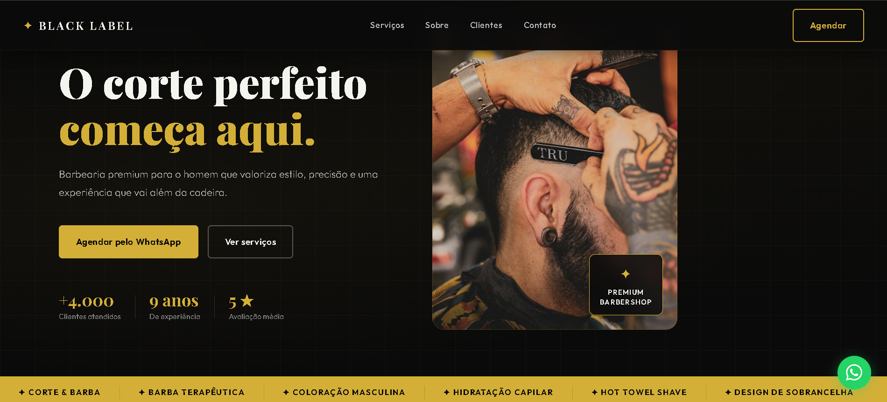

# Black Label - Barbearia LP

Landing page moderna e responsiva para uma barbearia fictícia, desenvolvida com HTML, CSS e JavaScript.

## 🚀 Deploy

Acesse o projeto online:

https://wallaceoppikofer.github.io/barbearia-lp/

## 📸 Preview

## 🛠 Tecnologias utilizadas

- HTML5
- CSS3
- JavaScript
- Git
- GitHub Pages

## ✨ Funcionalidades

- Layout responsivo
- Menu mobile
- Scroll suave
- Navegação intuitiva
- Estrutura semântica
- Animações leves

## 📚 Aprendizados

Neste projeto pratiquei:
- Estruturação semântica com HTML
- Responsividade com CSS
- Organização de pastas
- Manipulação básica do DOM
- Publicação com GitHub Pages

## 👨‍💻 Autor

Wallace Oppikofer
